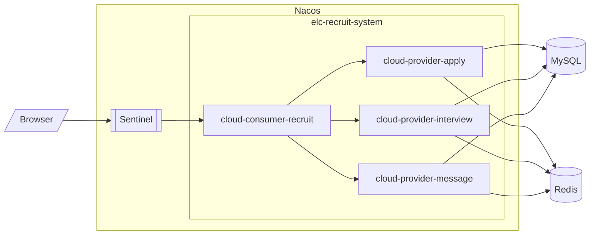

# GDUTELC 招新系统

## 本招新系统使用的模块：

- `cloud-api-commons`：通用API模块，用于放置通用的实体类
- `cloud-consumer-recruit91`：消费者模块，放置对外访问的所有接口
- `cloud-provider-apply9001`：生产者模块，放置与面试者报名相关的服务
- `cloud-provider-interview9002`：生产者模块，放置与面试相关的服务
- `cloud-provider-message9003`：生产者模块，放置与微信推送以及超管相关的服务

## 本项目使用的框架版本：

- Java: `17.0+`
- MySQL: `8.0`
- Redis: `6.0.0`
- SpringBoot: `2.6.6`
- SpringCloud: `2021.0.1`
- SpringCloudAlibaba" `2021.1`
- NacosServer: `2.1.0`
- SentinelDashboard: `1.8.5`

## 关于数据库：

数据库架构请参考：[./db/recruit-system.sql](./db/recruit-system.sql) 文件

<span style='color:yellow;background:背景颜色;font-size:文字大小;'>注意⚠️：为了数据库安全起见，MySQL数据库账户请使用`recruit`而不是`root`账户进行登录，相应地，`recruit`只授权对`recruit_system`数据库的读写许可！</span>

```sql
CREATE USER 'recruit'@'localhost' IDENTIFIED BY 'recruit';
GRANT ALL PRIVILEGES ON recruit_system.* TO 'recruit'@'localhost';
```

Redis数据库使用的索引为`5`

## 关于Nacos注册中心

此系统的Nacos所使用的版本为 **`2.1.0`**

Nacos采用单机部署，MySQL持久化策略

持久化数据库建表请参阅Nacos包下的`/mynacos/nacos/conf`目录下找到SQL脚本`nacos-mysql.sql`，并执行，数据库名称为`nacos_config`

持久化数据库请使用`nacos`用户登录

如何设置Nacos持久化: 在Nacos包下的配置文件`application.properties`中的末尾新增如下配置:

```properties
db.num=1
db.url.0=jdbc:mysql://127.0.0.1:3306/nacos_config?characterEncoding=utf8&connectTimeout=1000&socketTimeout=3000&autoReconnect=true&useSSL=false&serverTimezone=Asia/Shanghai
db.user=nacos
db.password=nacos
```
## 关于Sentinel流控

此系统使用的SentinelDashboard版本为 **`1.8.4`**

Sentinel的限流规则通过Nacos进行持久化

由于Java17与Sentinel之间存在兼容性问题，因此在启动SentinelDashboard的时候请使用以下的指令来启用

```shell
$ java -jar --add-exports=java.base/sun.net.util=ALL-UNNAMED sentinel-dashboard-1.8.4-customized.jar  
```

<span style='color:yellow;background:背景颜色;font-size:文字大小;'>注意⚠️：为了能够实现在SentinelDashboard上新增的流控规则可以自动持久化到Nacos中，我们重写了SentinelDashboard的源码, 如何重写请参阅: </span>

https://github.com/alibaba/Sentinel/wiki/Sentinel-控制台（集群流控管理）#规则配置

## 关于 Swagger

Swagger API 文档地址:

```http request
http://127.0.0.1:91/swagger-ui/index.html#
```

使用示例可以参考: 

[cloud-consumer-recruit91/src/main/java/com/gdutelc/recruit/controller/DemoController.java](cloud-consumer-recruit91/src/main/java/com/gdutelc/recruit/controller/DemoController.java)

## 开始使用 (以Ubuntu22为例)

### 1. 系统需求

|  指标  | 最低配置 | 推荐配置 |
|:----:|:----:|:----:|
| CPU  |  2核  |  4核  |
| RAM  |  4G  |  8G  |
| 磁盘空间 | 5GB  | 10GB |

### 2. 环境准备

#### 2.1. Java环境

使用apt安装Java(最好使用17)

```shell
$ apt-get install openjdk-17-jre-headless
```

验证 Java 版本是否正确

```shell
$ java -version
```
```shell
OpenJDK Runtime Environment (build 17.0.4+8-Ubuntu-122.04)
OpenJDK 64-Bit Server VM (build 17.0.4+8-Ubuntu-122.04, mixed mode, sharing)
```

#### 2.2. MySQL环境

使用apt安装MySQL

```shell
$ apt-get instll mysql-server
```

登录MySQL，创建招新系统和Nacos配置持久化数据库

```sql
CREATE DATABASE `recruit_system`;
CREATE DATABASE `nacos_config`;
```

执行初始化招新系统和Nacos配置持久化数据库SQL脚本

- 招新系统: [./db/recruit-system.sql](./db/recruit-system.sql)
- Nacos: Nacos包下的`/mynacos/nacos/conf`目录下找到SQL脚本`nacos-mysql.sql`

创建用户`recruit`和`nacos`并为其赋予对应数据库的权限(密码可以根据自己的喜好设定)

```sql
CREATE USER 'recruit'@'localhost' IDENTIFIED BY 'recruit';
GRANT ALL PRIVILEGES ON recruit_system.* TO 'recruit'@'localhost';
CREATE USER 'nacos'@'localhost' IDENTIFIED BY 'nacos';
GRANT ALL PRIVILEGES ON nacos_config.* TO 'nacos'@'localhost';
```

#### 2.3. Redis 环境

使用apt安装Redis

```shell
$ apt-get indtall redis
```
启动Redis, 并设置为开机启动

```shell
$ systemctl start redis
$ systemctl enabled redis
```

检查Redis是否成功启动

```shell
$ systemctl status redis
$ redis-cli
```

#### 2.4. Nacos 环境

下载Nacos2.1.0安装包

```shell
$ wget https://github.com/alibaba/nacos/releases/download/2.1.0/nacos-server-2.1.0.tar.gz
```

解压安装包

```shell
$ tar -zvxf nacos-server-2.1.0.tar.gz /root/nacos
```

修改Nacos配置文件，启动配置持久化

```shell
$ cd /root/nacos/conf
$ cp application.properties.example application.properties
$ vim application.properties
```

修改以下配置:

```properties
spring.datasource.platform=mysql
db.num=1
db.url.0=jdbc:mysql://127.0.0.1:3306/nacos_config?characterEncoding=utf8&connectTimeout=1000&socketTimeout=3000&autoReconnect=true&useSSL=false&serverTimezone=Asia/Shanghai
db.user=nacos
db.password=nacos # 密码更改为自己创建MySQL用户时设置的密码
```

编写Nacos服务文件

```shell
$ vim /lib/systemd/system/nacos.service
```

```properties
[Unit]
Description=Nacos Server
After=network.target

[Service]
Type=forking
# 单节点方式启动，填写实际路径
ExecStart=/root/nacos/bin/startup.sh -m standalone
# 集群方式启动-外部数据源启动，填写实际路径
# ExecStart=/opt/cloud/nacos/bin/startup.sh

ExecStop=/root/nacos/bin/shutdown.sh
PrivateTmp=true

[Install]
WantedBy=multi-user.target
```

启动Nacos, 并设置为开机启动

```shell
$ systemctl daemon-reload
$ systemctl start nacos
$ systemctl enabled nacos
$ systemctl status nacos
```

访问Nacos管理界面

```http request
127.0.0.1:8848/nacos
```

默认账户名和密码均为`nacos`

#### 2.5. Sentinel 环境

下载SentinelDashboard的jar文件

```shell
$ wget https://github.com/alibaba/Sentinel/releases/download/1.8.5/sentinel-dashboard-1.8.5.jar
$ mv sentinel-dashboard-1.8.5.jar /root/sentinel-dashboard-1.8.5.jar
```

编写Sentinel服务文件

```shell
vim /lib/systemd/system/sentinel-dashboard.service
```
```properties
[Unit]
Description=Sentinel Dashboard Customized Version
After=network.target

[Service]
ExecStart= /usr/bin/java -jar --add-exports=java.base/sun.net.util=ALL-UNNAMED /root/sentinel-dashboard-1.8.5.jar --server.port=8088

[Install]
WantedBy=multi-user.target
```

启动Sentinel, 并设置为开机启动

```shell
$ systemctl daemon-reload
$ systemctl start sentinel-dashboard
$ systemctl enabled sentinel-dashboard
$ systemctl status sentinel-dashboard
```

访问Sentinel管理界面

```http request
127.0.0.1:8088
```

默认账户名和密码均为`sentinel`

*可选: Sentinel流控配置持久化*

*https://github.com/alibaba/Sentinel/wiki/Sentinel-控制台（集群流控管理）#规则配置*

#### 2.6. 服务正式部署

由于我们这里采用的是Docker部署，因此在部署前请先确保服务器以及安装好了Docker和DockerCompose

##### 每个微服务单实例部署:

下载Docker编排文件:

```shell
$ wget https://github.com/gregPerlinLi/elc-recruit-system/master/elc-recruit-system-docker-compose.yml
```

部署:

```shell
$ docker-compose -f elc-recruit-system-docker-compose.yml up -d
```

##### 每个微服务多实例部署:

下载Docker编排文件:

```shell
wget https://github.com/gregPerlinLi/elc-recruit-system/master/elc-recruit-system-docker-compose-cluster.yml
```

部署:

```shell
$ docker-compose -f elc-recruit-system-docker-compose-cluster.yml up -d
```

### 端口使用状况

|           服务名            |   端口   |         说明         |
|:------------------------:|:------:|:------------------:|
|          Nacos           | `8848` |        配置中心        |
|         Sentinel         | `8088` |        熔断降级        |
|          MySQL           | `3306` |      MySQL数据库      |
|          Redis           | `6379` |      Redis缓存       |
|  cloud-consumer-recruit  |  `91`  |      服务消费者,网关      |
|   cloud-provider-apply   | `9001` |    服务提供者,报名相关服务    |
| cloud-provider-interview | `9002` |    服务提供者,面试相关服务    |
|  cloud-provider-message  | `9003` | 服务提供者,消息推送和管理员相关服务 |

### 服务调用关系

